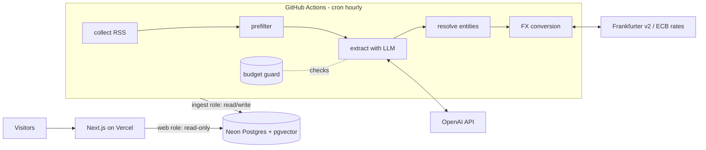

# SignalFeed specification (v1 = Phase 1)

SignalFeed collects public startup news, uses an LLM to extract structured facts, merges duplicate reports into companies and events, and shows patterns over time. It is open source (AGPL-3.0) and runs at close to zero cost.

## 1. Users and the questions they ask

Primary user: a founder deciding what to build. They want to know:

- which themes are attracting funding, and whether those themes are rising;
- where early momentum is: seed rounds increasing while few companies have reached Series A;
- who acquires young startups, in which themes, and how old the targets were;
- which investors write first cheques in each theme, and how big those cheques are;
- demand signals that move before funding: launches with traction and fast-growing open-source projects.

Phase 1 answers none of these directly. It builds the data foundation that lets Phases 2-4 answer them. Because RSS feeds only expose recent items, history only accumulates from the day ingestion starts. That is why Phase 1 ships scheduled ingestion before any trend features exist.

Possible later audience (Phase 4): UK freelancers and small agencies who want alerts when UK companies raise money (a "leads" view).

## 2. Phase 1 scope

In scope:

1. Collect items from verified startup-news RSS feeds (see `docs/sources.md`).
2. A free keyword prefilter, then one LLM extraction per relevant item into a versioned, validated JSON structure.
3. Entity resolution: merge reports into one company record and one event record (funding round, acquisition or launch), with a review queue for ambiguous matches.
4. Currency normalisation: keep the original amount, and also store USD and GBP figures converted at that day's ECB rate.
5. A read-only public website with a filterable funding table, company pages, investor pages, an about/methodology page and a status page.
6. Scheduled ingestion on GitHub Actions. Nothing in the web app can trigger ingestion or an LLM call.
7. A hard monthly LLM spend cap, defaulting to £3.
8. An extraction accuracy evaluation against 20-30 real headlines.
9. CI running lint, type checks, tests and a build on every push. Database changes go through migrations.
10. Public deployment and a README with screenshots, an architecture diagram and a limitations section.

The Phase 1 data model already covers acquisitions, launches, investors, company location, founding year and free-form theme tags. The extraction schema produces acquisitions and launches from day one, so that history exists by Phase 2.

## 3. Non-goals for Phase 1

- Theme grouping, weekly counts, rising scores, charts (Phase 2).
- Hacker News, GitHub and Y Combinator collectors (Phase 2). The schema is ready for them.
- Companies House and SEC filings (Phase 3). The schema has `uk_company_number` and `sec_cik` columns ready.
- Accounts, watchlists, alerts, email, the leads view, payments (Phase 4).
- Fetching or storing full article pages. Extraction uses the headline and the feed's own summary only.
- Showing any article text publicly. Only headlines, links and extracted facts are displayed.
- Storing names of individual people (founders, angels, officers) or any personal contact details.
- A public API, semantic search, or a mobile app.
- Deleting old history. All data is retained.

## 4. Architecture



- One TypeScript package. The Next.js app lives in `src/app`. The pipeline lives in `src/pipeline` and runs only as a CLI (`pnpm pipeline run`).
- `src/core` holds shared types, Zod schemas and port interfaces, and has no I/O.
- Lint rules stop `src/app` importing `src/pipeline` and vice versa. This keeps the OpenAI client out of the web bundle.
- The web app connects with a read-only Postgres role. Its environment contains no LLM key.

## 5. Data model

Postgres on Neon, defined in `src/db/schema.ts` with Drizzle and changed only through migrations in `drizzle/`. Extensions: `vector`, `pg_trgm`. All timestamps are `timestamptz` in UTC. Money is stored as integer minor units (pence, cents) in `bigint` columns, read as JS `number`.

### Enums (`src/core/enums.ts`, mirrored as Postgres enums)

| Enum | Values |
|---|---|
| `source_kind` | `rss`, `hn_algolia`, `yc_directory`, `github`, `companies_house`, `sec_edgar` |
| `source_item_status` | `pending`, `filtered_out`, `extracted`, `failed` |
| `event_type` | `funding_round`, `acquisition`, `launch` |
| `round_type` | `pre_seed`, `seed`, `series_a`, `series_b`, `series_c`, `series_d_plus`, `growth`, `debt`, `grant`, `unknown` |
| `investor_kind` | `vc`, `corporate`, `accelerator`, `angel_network`, `government`, `private_equity`, `family_office`, `other`, `unknown` |
| `investor_role` | `lead`, `participant`, `unknown` |
| `launch_kind` | `product`, `show_hn`, `launch_hn`, `open_source`, `other` |
| `evidence_level` | `reported` (news), `confirmed` (official filing, Phase 3) |
| `date_precision` | `day`, `month`, `year` |
| `company_status` | `active`, `acquired`, `closed`, `unknown` |
| `founded_year_source` | `news`, `companies_house`, `yc`, `manual` |
| `llm_purpose` | `extraction`, `embedding`, `eval` |
| `ingest_trigger` | `schedule`, `manual` |
| `ingest_status` | `running`, `succeeded`, `failed`, `budget_paused` |
| `merge_entity` | `company`, `investor` |
| `merge_candidate_status` | `open`, `merged`, `dismissed` |
| `alias_source` | `extraction`, `manual`, `merge` |

### Tables

Collection and processing:

- `sources`: `id`, `slug` (unique), `name`, `kind`, `url`, `priority` (smallint, higher wins ties), `enabled`, `etag`, `last_modified`, `last_fetched_at`, `created_at`.
- `source_items`: `id`, `source_id`, `external_id`, `url`, `canonical_url` (unique), `title`, `published_at`, `fetched_at`, `status`, `attempts`, `last_error`. Unique on (`source_id`, `external_id`).
- `source_item_texts`: `source_item_id` (PK), `summary`. This holds the feed-provided summary, used only as LLM input. It lives in its own table so the web role can be denied access to it.
- `extractions`: `id`, `source_item_id`, `prompt_version`, `model`, `result` (jsonb, validated against the extraction schema), `is_relevant`, `is_current`, `input_tokens`, `output_tokens`, `cost_usd_micros`, `created_at`, `resolved_at`. Unique on (`source_item_id`, `prompt_version`, `model`). A partial unique index allows only one `is_current = true` per item.
- `llm_usage`: `id`, `occurred_at`, `purpose`, `model`, `input_tokens`, `output_tokens`, `cost_usd_micros` (bigint), `source_item_id` (nullable), `ingest_run_id` (nullable). Index on `occurred_at`.
- `ingest_runs`: `id`, `started_at`, `finished_at`, `trigger`, `status`, `stats` (jsonb), `error`.
- `fx_rates`: `rate_date`, `currency` (char 3), `per_eur` (numeric 18,8). PK (`rate_date`, `currency`). These are ECB reference rates (EUR base). Cross rates are computed from them.

Entities:

- `companies`: `id`, `slug` (unique, never changes), `name`, `normalised_name`, `website_domain` (unique, nullable), `description` (one line, at most 200 characters, generated from the extracted facts), `country_code` (ISO 3166-1 alpha-2), `city`, `founded_year`, `founded_year_source`, `status`, `uk_company_number` (unique, nullable), `sec_cik` (unique, nullable), `yc_batch`, `github_org`, `embedding` (vector 512, nullable), `embedding_model`, `merged_into_id` (self FK, nullable), `first_seen_at`, `updated_at`. Indexes: GIN trigram on `normalised_name`, btree on `normalised_name`.
- `company_aliases`: `id`, `company_id`, `alias`, `normalised_alias`, `source`. Unique (`company_id`, `normalised_alias`). GIN trigram index on `normalised_alias`.
- `tags`: `id`, `slug` (unique), `label`, `embedding` (vector 512, nullable), `embedding_model`, `first_seen_at`.
- `company_tags`: `company_id`, `tag_id`, `source`, `mention_count`, `first_seen_at`, `last_seen_at`. PK (`company_id`, `tag_id`).
- `investors`: `id`, `slug` (unique), `name`, `normalised_name`, `kind`, `country_code`, `website_domain`, `merged_into_id`, `first_seen_at`. Organisations only.
- `investor_aliases`: same shape as `company_aliases`.

Events use class-table inheritance: one base table plus one detail table per type.

- `events`: `id`, `type`, `company_id` (the subject: the funded company, the acquisition target, or the launching company), `announced_on` (date), `date_precision`, `evidence`, `source_count`, `first_seen_at`, `updated_at`. Indexes on (`type`, `announced_on`) and on `company_id`.
- `funding_rounds`: `event_id` (PK, FK cascade), `round_type`, `round_label` (raw wording, e.g. "seed extension"), `amount_minor`, `currency`, `amount_usd_minor`, `amount_gbp_minor`, `fx_rate_date`, `includes_individual_angels`.
- `acquisitions`: `event_id` (PK), `acquirer_company_id` (nullable FK to `companies`), `acquirer_name` (raw), `price_minor`, `currency`, `price_usd_minor`, `price_gbp_minor`, `fx_rate_date`.
- `launches`: `event_id` (PK), `kind`, `product_name`, `url`, `external_ref` (for example an HN item id or a GitHub `owner/repo`).
- `launch_metric_snapshots`: `id`, `event_id`, `metric` (text: `points`, `comments`, `stars`, `forks`), `value`, `observed_at`. Phase 2 fills this.
- `event_investors`: `event_id`, `investor_id`, `role`. PK (`event_id`, `investor_id`).
- `event_sources`: `event_id`, `extraction_id`, `source_item_id`, `event_index` (position in `extraction.result.events`). PK (`event_id`, `extraction_id`, `event_index`).

Data quality:

- `merge_candidates`: `id`, `entity_type`, `left_id`, `right_id`, `score` (real), `reason`, `status`, `created_at`, `resolved_at`. Unique (`entity_type`, `left_id`, `right_id`).
- `entity_merges`: `id`, `entity_type`, `kept_id`, `merged_id`, `merged_at`, `note`. This is the audit log.

Region (UK, Europe, North America, and so on) is derived from `country_code` in code (`src/lib/regions.ts`), not stored.

Later phases add tables (for example `themes`, `tag_themes`, `theme_weekly_stats`, `filings`) without rewriting existing rows.

### Database roles

| Role | Used by | Rights |
|---|---|---|
| owner (Neon default) | `pnpm db:migrate` in the migrate workflow | DDL |
| `signalfeed_ingest` | GitHub Actions ingest job | `SELECT, INSERT, UPDATE, DELETE` on all tables and sequences |
| `signalfeed_web` | Vercel | `SELECT` on all tables except `source_item_texts` |

## 6. Extraction contract

`src/core/extraction-schema.ts` exports `EXTRACTION_SCHEMA_V1` (Zod) and its inferred type. It must be compatible with OpenAI strict structured outputs: every property is required, unknown values are `null` rather than omitted, and objects are strict.

```ts
{
  isRelevant: boolean,               // reports a completed funding round, acquisition or launch by a startup/scale-up
  events: Array<{                     // max 10 (roundup articles can list several)
    type: 'funding_round' | 'acquisition' | 'launch',
    company: {
      name: string,
      websiteDomain: string | null,  // only if it appears in the text
      description: string | null,    // <= 200 chars, facts only
      countryCode: string | null,    // ISO alpha-2
      city: string | null,
      foundedYear: number | null,
      tags: string[],                // 0-5 short lowercase theme phrases, e.g. "ai agents", "climate fintech"
    },
    announcedOn: string | null,      // YYYY-MM-DD if stated
    funding: {
      roundType: RoundType,
      roundLabel: string | null,
      amountText: string | null,     // verbatim, e.g. "$12.5M", "€3 million", "£750k"
      currencyHint: string | null,   // ISO 4217 if the text makes it clear
      investors: Array<{ name: string, kind: InvestorKind, isLead: boolean }>, // organisations only
      includesIndividualAngels: boolean,
    } | null,
    acquisition: {
      acquirerName: string,
      acquirerDomain: string | null,
      acquirerCountryCode: string | null,
      priceText: string | null,
      currencyHint: string | null,
    } | null,
    launch: { kind: LaunchKind, productName: string | null, url: string | null } | null,
  }>
}
```

Principle: **the LLM finds, code computes.** Amounts come back as verbatim text and are parsed deterministically by `src/lib/money.ts`. Domains are kept only if they literally appear in the item's title, summary or URL. Tags are normalised by code. All of this is unit-testable.

Rumours ("in talks to raise"), valuations without a raise, and layoffs are not events.

## 7. Pipeline

Run with `pnpm pipeline run` (GitHub Actions hourly) or one step at a time with `pnpm pipeline <step>`. Each step is idempotent, and nothing runs on server start.

1. **Lock.** Take a Postgres advisory lock (constant key). If another run holds it, exit 0. The workflow also uses a concurrency group.
2. **Collect.** For each enabled RSS source, make a conditional GET (ETag / Last-Modified), parse RSS 2.0 or Atom, and insert new `source_items` plus `source_item_texts`. Existing URLs are ignored (`ON CONFLICT DO NOTHING` on `canonical_url`). Canonical URL means lowercase host, no tracking parameters, no fragment and no trailing slash.
3. **Prefilter.** A deterministic keyword and money-pattern check on title and summary. Non-matching items become `filtered_out`. The eval measures recall to make sure relevant fixtures always pass.
4. **Extract.** Take up to `MAX_EXTRACTIONS_PER_RUN` (default 150) pending items, oldest first. For each:
   - ask the budget guard whether the worst-case cost fits the cap;
   - call the LLM;
   - validate the response with Zod;
   - store the `extractions` row and the `llm_usage` row.

   Validation or API errors increment `attempts`, and after 3 attempts the item becomes `failed`. If the budget is exhausted, the step stops cleanly, items stay `pending`, and the run status is `budget_paused`.
5. **Resolve.** For each current extraction with `resolved_at IS NULL`, open one transaction: post-process the facts, resolve the company and investors, match or create the event, link `event_sources`, recompute the event's canonical fields, then set `resolved_at`.
6. **FX.** Fetch any missing ECB rates for dates referenced by events, then fill the `*_usd_minor` and `*_gbp_minor` columns. If there is no rate for a date, use the nearest earlier rate within 7 days.
7. **Record.** Write `ingest_runs.stats` (counts per step, spend this run, month-to-date spend, cap) and release the lock.

Re-extraction after a prompt change is explicit: `pnpm pipeline reextract --prompt-version v2 [--limit N] [--dry-run]`. A dry run prints the estimated cost. A real run requires `--yes`, stays subject to the cap, marks the new extraction current, and re-resolves the item. Events left with no sources are deleted, because they are derived data.

### Entity resolution rules

Company name normalisation (`src/lib/normalise.ts`):
- lowercase;
- strip diacritics;
- remove legal suffixes (inc, ltd, limited, llc, plc, gmbh, sas, bv, ab, oy, corp, co);
- turn a domain-style name into its base ("acme.ai" becomes "acme");
- remove punctuation and collapse whitespace.

Company matching is applied in order, and the first match wins:
1. **Domain.** The validated domain equals `companies.website_domain`. Match.
2. **Exact name.** The normalised name equals a company's `normalised_name` or one of its aliases, and nothing conflicts. A conflict means both countries are known and differ, or both domains are known and differ. One candidate: match. Several: prefer one with no conflict and the most recent activity. If it is still ambiguous, create a new company and a merge candidate.
3. **Fuzzy with corroboration.** Trigram similarity is at least 0.6 and the incoming event corroborates an existing event of that candidate. Corroboration means the same round type, or amounts within 15%, within ±45 days. Then match and add an alias.
4. Otherwise create a new company. If the best fuzzy score is at least 0.6, also add a merge candidate.

Investors: a domain match or an exact normalised name/alias match. Anything else creates a new investor. Similar names (trigram ≥ 0.7) become merge candidates. Investor names are never merged automatically on fuzzy evidence.

Event matching, for the resolved subject company:
- **Funding round.** An existing round of that company within ±45 days (using `announced_on`, or the item's published date). It matches if the round types are equal (and known), or the amounts in USD are within 15%, or one side has neither round type nor amount and it is the only round in the window. Known, different round types with amounts more than 15% apart mean a separate event.
- **Acquisition.** Same target within ±60 days, with the same acquirer or one side's acquirer unresolved.
- **Launch.** Same company within ±14 days, and the same normalised product name or URL.

Canonical fields are recomputed from all linked extractions every time, so the result is deterministic and order-independent:
- For each scalar, take the most frequent non-null value. Break ties by source `priority`, then by the earliest published item.
- `announced_on` is the earliest stated date. If none is stated, use the earliest item's published date with precision `day`.
- Investors are the union of all sources. An investor is a lead if any source says so.
- `source_count` is the number of distinct source items.

Manual tools (`pnpm entities ...`) list candidates, merge, dismiss and add aliases. A merge repoints events, aliases, tags and investors, sets `merged_into_id`, logs to `entity_merges`, and recomputes the affected events. Pages for merged companies redirect to the surviving company.

There are no special cases keyed on particular headlines or company names. A fix for a bad merge belongs in the rules, with a test, or in a recorded manual merge.

## 8. Spend cap

- `LLM_MONTHLY_CAP_GBP` (default 3) is converted to USD with the latest stored GBP rate. If no rate exists yet, use 1.0, which errs on the safe side.
- Before every LLM call the guard checks `month_to_date_usd + worst_case_cost <= cap`. Worst case is (estimated input tokens × 1.2 + `max_output_tokens`) at the model's price. Months are calendar months in UTC.
- If the model has no entry in the price table, the call is refused. The guard fails closed.
- Every call records actual usage in `llm_usage`.
- A per-run limit (`MAX_EXTRACTIONS_PER_RUN`) caps the damage from any single run.
- A second layer of protection sits with the provider: OpenAI prepaid credits with auto-recharge off (assumption A10). The provider stops serving requests once the credit runs out.
- The web app holds no LLM key, so visitors cannot cause spend.

## 9. Pages and routes

All pages are server-rendered and read-only. Database reads go through `src/lib/cached.ts`, which caches for 10 minutes to limit Neon compute wake-ups. `next build` must not need a database.

| Route | Content |
|---|---|
| `/` | Funding table. Filters in the URL: `q` (company name), `round` (multi), `region`, `country`, `tag`, `investor`, `from`, `to`, `min`, `max` (GBP), `sort` (`announced` / `amount` / `relevance`), `dir`, `page`. Columns: company, location, round, amount (GBP, with the original underneath if different), lead investors, date, number of sources. |
| `/companies/[slug]` | Name, location, founded year, status, tags, description. A timeline of funding rounds, acquisitions and launches, each with source headlines linked to the original articles. Merged slugs redirect to the surviving company. |
| `/investors/[slug]` | Investor name, kind, and the rounds it took part in (lead/participant), with a count by round type. |
| `/about` | Methodology, sources with attribution, what is and isn't stored, limitations, licence. |
| `/status` | Last ingest runs, item counts by status, events by type, month-to-date LLM spend against the cap. |

Sort semantics: when `q` is present and `sort` is not set, results are ordered by relevance (trigram similarity) with date as a tie-breaker. Otherwise they are ordered by the chosen column. A test asserts that relevance actually changes the order.

## 10. Testing

- **Unit (Vitest):** pure functions (normalisation, money parsing, prefilter, feed parsing, matching, canonicalisation, filter parsing).
- **Integration (Vitest + PGlite):** each test gets an in-process Postgres with migrations applied (`src/db/testing.ts`). This covers repositories, the resolver, the budget guard and queries. No Docker and no shared database, so parallel worktrees never collide.
- **Migrations:** a CI job applies migrations to a real `pgvector/pgvector` Postgres service container.
- **No network in tests:** `vitest.setup.ts` makes `fetch` throw. Collectors and LLM clients are tested through fakes of the port interfaces.
- **Extraction eval:** `pnpm eval --live` runs the fixture set against a real model and writes `docs/eval-results.md`. It costs pennies, needs a key, and is not run in CI. `pnpm eval --replay` scores recorded responses, which CI runs through a test so scorer and parser regressions are caught. Initial targets are below.
- **CI** (`.github/workflows/ci.yml`, on every push and PR): `pnpm lint`, `pnpm typecheck`, `pnpm test`, `pnpm build`, plus the migrations job.

Initial extraction accuracy targets (`pnpm eval --live`):

| Metric | Target |
|---|---|
| Relevance (`isRelevant`) | ≥ 95% |
| Event type | ≥ 95% |
| Company name (normalised exact match) | ≥ 90% |
| Round type | ≥ 85% |
| Amount and currency (parsed, exact) | ≥ 90% |
| Lead investors | F1 ≥ 0.8 |
| Country | ≥ 80% where expected is not null |
| Prefilter recall on relevant fixtures | 100% |

## 11. Hosting

| Piece | Service | Plan |
|---|---|---|
| Web | Vercel | Hobby (free; non-commercial use only, A12) |
| Database | Neon | Free (A11) |
| Scheduled jobs + CI | GitHub Actions | Free for public repos (A13) |
| LLM | OpenAI API | Prepaid credits, auto-recharge off (A10) |
| FX rates | Frankfurter v2, ECB provider (`api.frankfurter.dev`) | Free, no key (A9). The v1 host `api.frankfurter.app` still responds but is legacy. |
| Domain | `*.vercel.app` | Free |

Secrets: Vercel has `DATABASE_URL` (web role). GitHub Actions has `DATABASE_URL` (ingest role), `DATABASE_URL_OWNER` (migrate workflow only) and `OPENAI_API_KEY`. The repo variable `INGEST_ENABLED` acts as a kill switch.

## 12. Monthly running-cost estimate

Assumptions, measured on 8 October 2026 (`docs/sources.md`): five enabled feeds and about 33 new items/day, so about 1,000/month. About 40% pass the prefilter, giving about 400 LLM calls. Each call uses about 1,500 input and 300 output tokens, so about 0.6M input and 0.12M output tokens/month. Conversion is $1.30 = £1. Prices are the confirmed OpenAI rates for `gpt-4.1-nano` (cheap) and `gpt-4.1-mini` (mid).

| Item | Estimate / month |
|---|---|
| LLM extraction, cheap tier ($0.10 / $0.40 per M tokens) | ≈ £0.08 |
| LLM extraction, mid tier ($0.40 / $1.60 per M tokens) | ≈ £0.35 |
| Same, if the prefilter were removed | ≈ £0.20-£0.90 |
| Eval runs | < £0.05 |
| Vercel, Neon, GitHub Actions, domain | £0 |
| **Total** | **≈ £0.10-£0.80** |

The £3 cap is well above normal ingestion. A run still pauses with status `budget_paused` if spend hits the cap, and remaining items stay `pending`. Re-extracting a year of prefiltered items on the cheap model stays under the cap. Re-extracting every stored item on the mid-tier model can approach or exceed it, so use `--limit` or raise the cap for that run. OpenAI's minimum prepaid top-up (about $5, A10) is a one-off payment that should last many months.

Storage: about 10 MB/month at the measured volume. Neon Free allows 1 GB per project, so this fits for years. Hourly ingestion wakes the database briefly; that stays inside the 100 CU-hour monthly allowance.

## 13. Assumptions for Task 001 to verify

Verified on 8 October 2026. Outcomes and links are in `docs/sources.md`. The rows below are the verified facts, not the original guesses.

| # | Assumption | Needed in |
|---|---|---|
| A1 | Five feeds are enabled: TechCrunch Venture, Crunchbase News, Tech.eu, EU-Startups, UKTN. They return title, link, pubDate and a usable description. Sifted's feed has no description and is disabled. | 1 |
| A2 | Phase 1 may show headline, link and extracted facts with attribution. Crunchbase is enabled: extraction is not model training (maintainer decision, 8 Oct 2026). Sifted stays off because its terms ban using content to develop or validate AI. Commercial use (Phase 4) still needs a separate review for every publisher. | 1, 4 |
| A3 | Poll hourly. EU-Startups only keeps about a day of items, so a 3-hour schedule risks gaps when a run is delayed. | 1 |
| A4 | HN Algolia API is free and keyless. Show HN is available via `tags=show_hn`. Launch HN needs a title query. | 2 |
| A5 | YC has no official public directory API. Check unofficial mirrors (for example yc-oss) and their terms. | 2 |
| A6 | GitHub REST API allows 5,000 requests/hour with a token. Search API is about 30 requests/minute. | 2 |
| A7 | Companies House API: free key, 600 requests per 5 minutes. Filing history exposes SH01 under the capital category. The Document API serves PDFs. A streaming API exists. Reuse is permitted under its licence. | 3 |
| A8 | SEC EDGAR requires a User-Agent with contact details and allows at most 10 requests/second. Form D is available as XML via daily indexes. | 3 |
| A9 | Frankfurter v2 (`https://api.frankfurter.dev/v2/providers/ecb/rates`) serves free ECB daily rates, including GBP and USD, with no key. v1 still responds. | 1 |
| A10 | Confirmed 8 Oct 2026: `gpt-4.1-nano` $0.10/$0.40 per M tokens (default candidate), `gpt-4o-mini` $0.15/$0.60, `gpt-4.1-mini` $0.40/$1.60. Strict JSON-schema output works. Prepaid credits, auto-recharge off, $5 minimum top-up. `text-embedding-3-small` supports `dimensions: 512`. | 1 |
| A11 | Neon Free: 1 GB storage per project, 100 CU-hours/month, scale to zero after 5 minutes idle, `vector` and `pg_trgm` available, custom roles via SQL | 1 |
| A12 | Vercel Hobby: free, non-commercial only; limits relevant to server rendering | 1, 4 |
| A13 | GitHub Actions: free minutes for public repos; scheduled runs may be delayed; schedules are disabled after 60 days without repository activity | 1 |
| A14 | Real headlines and URLs are acceptable for TechCrunch, Tech.eu, EU-Startups and UKTN. Do not put Sifted or Crunchbase headlines in the public fixture file. | 1 |
